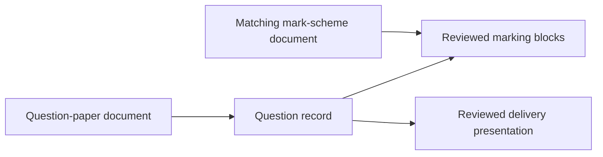

# Prepify pipeline — QP/MS ingestion to student feedback

This document defines the operational and data-integrity pipeline for Prepify. It is intentionally explicit about what is automated, what requires review, what evidence is retained, and which features remain gated.

## 1. Scope and invariants

The current source set contains exactly two exam-document types:

- question paper (`qp` → `question_paper`);
- mark scheme (`ms` → `mark_scheme`).

Examiner reports, inserts/data files, and syllabus documents are outside this phase. The ingestion filename parser rejects them. A source directory must therefore contain only supported QP/MS pairs.

The pipeline must preserve these invariants:

1. A full mock contains reviewed real past-paper questions only.
2. A selected question has a matching mark-scheme document from the same syllabus, series, and paper code.
3. A selected question has at least one reviewed question block and one reviewed matching mark-scheme block.
4. Matching mark-scheme evidence is stored privately with the assembly and is not sent in the public exam response.
5. A full mock spans at least two historical series unless the reviewed specification requires more.
6. Generated MCQs stay in a separately labeled practice path.
7. Insert/data-file dependent questions are excluded, not delivered partially.
8. Gated graders never fabricate scores.
9. Raw code/pseudocode submissions pass from the browser to the relevant grader unchanged.

## 2. Source acquisition

There is no automatic web scraper in the repository. An authorized operator obtains PDF files through a lawful channel and places them in a private import directory. This separation is deliberate: legal permission, access control, and retention policy are administrative concerns, not something a crawler can infer.

Recommended import layout:

```text
private-source/
  9618_s23_qp_21.pdf
  9618_s23_ms_21.pdf
  9618_w24_qp_21.pdf
  9618_w24_ms_21.pdf
```

The operator should verify before ingestion:

- the subject code is `9618`;
- each question paper has the corresponding mark scheme;
- the series and paper code in both filenames match the actual documents;
- there are no examiner reports, inserts, or unrelated PDFs in the directory;
- the organization is permitted to store and display the content to its intended users.

## 3. Filename identity and matching

`prepify.ingestion.filenames.parse_document_identity` accepts:

```text
{syllabus}_{series}_{qp|ms}_{paper-code}.pdf
```

Example:

```text
9618_s23_qp_21.pdf
```

becomes:

```json
{
  "syllabus_code": "9618",
  "series": "s23",
  "document_type": "question_paper",
  "paper_code": "21",
  "paper_number": 2,
  "variant": 1
}
```

The match key is:

```text
(syllabus_code, series, paper_code)
```

Question and mark-scheme files must share that exact key. The system does not use fuzzy filename matching because a wrong variant or series would silently attach the wrong marking evidence.

## 4. PDF extraction

`IngestionPipeline.ingest_directory` discovers PDFs recursively and processes them in sorted order.

For each supported PDF:

1. The filename is parsed into a `DocumentIdentity`.
2. The file is hashed and upserted into `documents`.
3. `PDFExtractor` reads each page.
4. Pages with usable embedded text stay on the embedded-text path.
5. Pages below the configured character threshold are rendered and sent to the configured Qwen3-VL-compatible OCR endpoint.
6. Extracted content is segmented into structured blocks.

Question-paper blocks are typed `question`; mark-scheme blocks are typed `mark_scheme`. Other source types are no longer emitted by the current OCR prompt.

Each `IngestionBlock` preserves:

- document ID;
- page number;
- question and parent-question numbers;
- point label, where available;
- topic tag and marks, where extracted;
- raw text;
- extraction method;
- fingerprint for idempotency;
- review status and reasons;
- indexing state.

## 5. Review gate

Embedded PDF text can be auto-trusted because it is copied from the document text layer. Vision OCR is treated more cautiously, especially for code and pseudocode where a single character can change meaning.

The verification module flags patterns such as:

- assignment arrows;
- pseudocode control structures;
- code-like tokens;
- low-confidence or structurally risky extraction.

Flagged blocks receive `pending_review` and are not indexed. A human reviewer uses:

```powershell
python -m prepify.ingestion.cli reviews
python -m prepify.ingestion.cli approve BLOCK_ID
```

Approval means the reviewer compared the block with the PDF and accepted its text/metadata. Only `auto_trusted` and `approved` blocks are eligible for indexing or assembly evidence.

## 6. Question creation and QP/MS linkage

Question records are created only from question-paper blocks with a question number. Their identity is unique within the source document.

After all files are processed, `Repository.link_documents_and_blocks`:

1. finds the mark-scheme document with the same match key as the QP;
2. writes its ID to `Question.linked_mark_scheme_id`;
3. forces `Question.linked_insert_id` to `None` for the current scope;
4. attaches mark-scheme blocks whose question number equals the question record’s number;
5. resolves parent/sub-question relationships where possible.

This creates the central relationship:



A PDF pair alone is not enough. The question is assembly-eligible only when the matching marking block itself is reviewed and linked.

## 7. Retrieval indexing

Qdrant uses two collections:

- `prepify_question_text`;
- `prepify_mark_scheme`.

The old syllabus/reference collection is no longer created or queried by the active ingestion path.

Only reviewed blocks are embedded. Point payloads include block/document/question identifiers, paper code, paper number, series, topic, page, point label, and review status. The vector store is a retrieval aid; PostgreSQL remains the source of truth for relationships and gates.

Supplementary MCQ generation retrieves reviewed question blocks for the requested topic. The generator must paraphrase and cannot present generated practice as a real past-paper question.

## 8. Human-reviewed delivery manifests

Ingestion text is not automatically published to students. The assembly administrator loads two reviewed contracts.

### 8.1 Paper specification manifest

The manifest describes:

- paper number and title;
- time limit and total marks;
- topic and assessment-objective weights;
- exact answer-surface/mark/count slots;
- minimum distinct source series;
- reviewed source question-paper document IDs;
- reviewed source question-block IDs;
- reviewer identity.

All slot source types must be `past_paper`. Weight totals must reconcile to `1.0` or `100`, and slot marks must equal total marks.

Unlike the earlier design, this specification does not cite an ingested syllabus PDF. It is a reviewed operational contract derived from actual historical paper structures. The responsible reviewer must check it against authoritative current assessment information before production use.

### 8.2 Question-pool presentation manifest

This manifest authorizes an ingested question for delivery and defines:

- surface (`written`, `pseudocode`, or `code`);
- reviewed display text;
- written subparts and marks;
- assessment-objective marks;
- delivery authorization and reviewer.

The loader verifies:

- the paper requires the chosen surface;
- marks reconcile;
- a reviewed question block exists;
- `linked_mark_scheme_id` exists;
- a reviewed mark-scheme block from that linked document exists;
- the topic tag resolves to a supported topic;
- there are no resources or `requires_resources` flags.

## 9. Multi-series exam assembly

`ExamAssembler.assemble` receives:

```json
{
  "paper_number": 3,
  "seed": "revision-set-01",
  "strict_timer": true,
  "allow_novel_generation": false
}
```

The literals prevent the client from silently disabling strict timing or enabling novel full-paper generation.

Assembly proceeds as follows:

1. Load the approved historical-question-paper specification.
2. Expand its slot counts into individual required slots.
3. Load validated, delivery-authorized real-question candidates for that paper.
4. Exclude any resource-dependent candidate.
5. Exclude any candidate missing reviewed matching mark-scheme blocks.
6. For each slot, filter by surface, marks, source type, and approved topic.
7. Score candidates by topic deficit, assessment-objective deficit, and historical-series diversity.
8. Use a SHA-256-derived tie-break based on seed, slot position, and source ID.
9. Verify marks, weights, and minimum series after selection.
10. Persist the assembly.

The public question contains source traceability:

- source series;
- paper code;
- question number.

The internal stored item additionally contains `mark_scheme_chunk_ids`. Those IDs are removed from `POST /v1/exams/assemble` and `GET /v1/exams/{id}` responses, along with any MCQ correct-answer field.

## 10. Frontend delivery

Outside an exam, the original Prepify Prep-Panel provides five areas.

### Dashboard

Reads device-local attempt summaries and shows only observed evidence. With no attempts, it renders a true empty state.

### Analytics

Aggregates:

- scored marks;
- MCQ correct/total;
- Paper 4 passed/total test cases;
- written hit/total award conditions;
- completion, topics, and attempt history.

Only feedback with an actual graded result contributes to score denominators. Gated work is not converted into zero.

### Prep-bot

The browser sends a message plus at most eight prior turns to the Prepify backend. The Gemini key never enters browser JavaScript.

### Resources

Displays a filterable list of external learning links. Content is not mirrored or scraped into Prepify.

### Exam workspace

The Prep-Panel disappears in strict mode. The timer continues while the tab is hidden and has no pause control.

Three separate answer components remain intentional:

- `MCQSurface` for radio selection;
- `CodeSurface` for CodeMirror code/pseudocode input;
- `WrittenSurface` for subpart-segmented text.

There is no generic answer renderer.

## 11. Grading paths

### MCQ practice

The selected index is graded against a private correct index. This applies to separately labeled supplementary practice, not full real-question assembly.

### Paper 4 execution (MVP2 Phase 1)

The browser posts raw source code and language to the Paper 4 endpoint. The backend loads reviewer-defined cases, runs code inside a restricted Docker sandbox, compares output, and returns per-case results.

The response distinguishes `certified` from provisional results. The phase remains blocked until the configured held-out dataset reaches the validation threshold and the sandbox profile matches the validated profile.

### Paper 2 pseudocode (Phase 2)

Not implemented. The surface preserves raw pseudocode, but submission is gated. Future feedback must visually distinguish transpilation failure from logic-test failure.

### Paper 1/3 written (Phase 3)

Not implemented. Answers are already segmented by subpart. Future grading must return per-award-condition hit/miss plus reason, never only a flat score.

## 12. Prep-bot request path

`POST /v1/prep-bot/chat` accepts:

```json
{
  "message": "Explain recursion with a small trace",
  "history": [
    {"role": "user", "text": "I do not understand the base case"}
  ]
}
```

`GeminiPrepBotService` calls:

```text
POST https://generativelanguage.googleapis.com/v1/interactions
x-goog-api-key: <server secret>
```

The payload includes:

- configured model (default `gemini-3.5-flash`);
- current input and bounded history;
- a 9618 tutor/navigation instruction;
- `store: false`;
- low temperature and bounded output.

Network/auth errors become a safe `503`; the upstream key or raw error body is not returned to the browser.

## 13. Attempt analytics persistence

When a non-demo exam is finished, the browser records one summary in `localStorage`:

```text
prepify.attempts.v1
```

The stored summary contains no full answers or mark-scheme text. It includes assembly ID, title, paper, date, completion, graded aggregates, time used, and topics. At most 50 summaries are retained, with a repeat assembly replacing its earlier entry.

This is an MVP constraint. Clearing browser data removes analytics, and a different device has no access to them.

## 14. Failure behavior

| Failure | Behavior |
|---|---|
| Unsupported filename | Ingestion rejects it with the accepted QP/MS pattern |
| Missing matching MS | Question remains ineligible for assembly |
| Pending OCR review | Block is not indexed or used as trusted evidence |
| Missing reviewed MS block | Presentation load/assembly fails closed |
| Insufficient source series | Specification or assembly fails |
| Insert/data dependency | Question is rejected/excluded |
| Slot cannot be filled | Assembly returns conflict instead of changing the paper |
| Weight tolerance fails | Assembly returns conflict |
| Gated grader | UI preserves answer without inventing marks |
| Gemini key missing | Prep-bot returns `503` and UI shows configuration error |
| LocalStorage unavailable | Exam completion succeeds; analytics persistence is skipped |

## 15. Verification checklist

After a pipeline change:

1. Run `python -m pytest -q`.
2. Run `npm run lint` in `frontend`.
3. Run `npm test` in `frontend`.
4. Confirm QP/MS filenames parse and ER/IN filenames fail.
5. Confirm a matching mark-scheme block attaches to the expected question ID.
6. Confirm an unreviewed block cannot enter the pool.
7. Confirm an assembled paper contains multiple series.
8. Confirm public responses contain no `mark_scheme_chunk_ids`.
9. Confirm internal assembly records do contain those IDs.
10. Confirm generated MCQs cannot be specified as full-paper slots.
11. Confirm gated results do not reduce analytics rates.
12. Confirm the Gemini key is absent from frontend output.

## 16. Production handoff

Before real users:

- introduce migrations rather than `create_all` schema drift;
- move analytics to authenticated server-side attempt records;
- implement access control for copyrighted content;
- define retention and deletion procedures;
- host PostgreSQL and Qdrant with backups;
- deploy the FastAPI service and configure CORS for the exact frontend origin;
- use managed secret storage;
- complete held-out grading validation;
- add observability without logging student answers or secrets;
- conduct legal, privacy, and security reviews.
